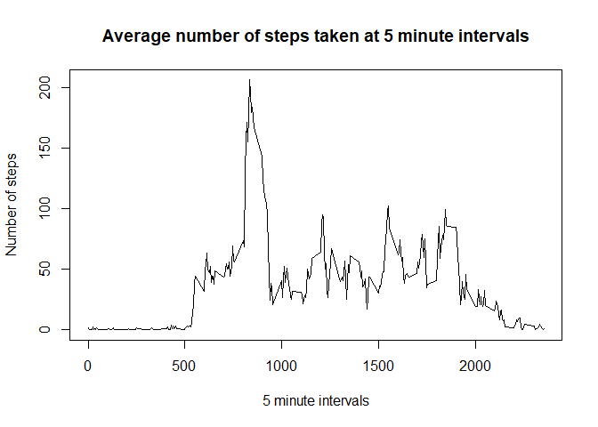
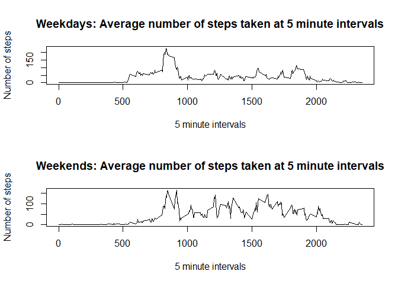

## Loading and preprocessing the data

This is the code for reading in the data set.


```r
temp <- tempfile()
download.file("https://d396qusza40orc.cloudfront.net/repdata%2Fdata%2Factivity.zip",temp, mode="wb")
unzip(temp, "activity.csv")
activity <- read.csv("activity.csv")
```

## What is mean total number of steps taken per day?

This is a histogramme of the number of steps taken per day. The NA values are excluded.


```r
#get the complete cases of activity
activity_compl <- activity[complete.cases(activity),]

#histogram of the total number of steps taken each day
par(mfrow=c(1,1))
activity_compl_total <- tapply(activity_compl$steps, activity_compl$date, sum)
hist(activity_compl_total, main = "Total number of steps taken each day", xlab = "Number of steps")
```

<!-- -->

This is the **mean** of the of the total number of steps taken each day. The NA values are excluded.


```r
mean(tapply(activity_compl$steps, activity_compl$date, sum))
```

```
## [1] 10766.19
```

This is the **median** of the of the total number of steps taken each day. The NA values are excluded.


```r
median(tapply(activity_compl$steps, activity_compl$date, sum))
```

```
## [1] 10765
```

## What is the average daily activity pattern?

This is the code to get the average number of steps per interval. 


```r
#total number of steps per day
x <- tapply(activity_compl$steps, activity_compl$interval, mean)
step_interval <- data.frame(key=names(x), value=x)
```

This is a time series plot of the average number of steps taken. The plot uses the data generated in the above code.


```r
#plot
par(mfrow=c(1,1))
with(step_interval,plot(key,value, main = "Average number of steps taken at 5 minute intervals", 
                        ylab = "Number of steps",
                        xlab = "5 minute intervals",
                        type = "l"))
```

<!-- -->

This is the code to establish which 5-minute interval, on average, contains the maximum number of steps .


```r
step_interval[step_interval$value == max(step_interval$value),1]
```

```
## [1] "835"
```

## Imputing missing values

This piece of code established the number of incomplete records in the dataset.


```r
sum(complete.cases(activity) == FALSE)
```

```
## [1] 2304
```

The strategy for imputing the missing values is to assign the corresponding step mean to the missing step values.

**Firstly**, the mean per step (where data is available) is calculated.


```r
x <- tapply(activity_compl$steps, activity_compl$interval, mean)
step_interval <- data.frame(interval=names(x), value=x)
```

**Secondly**, a dataframe similar to the original is created and is merged with the mean per step as calculated above.


```r
#create dataframe similar to the original
activity_impute <- activity
#merge with step_interval mean
activity_impute <- merge(activity_impute,step_interval)
```

**Thirdly**, the missing values are replaces with the mean per step. The columns that are not needed anymore are removed and the remaining columns are renamed to match the original data.


```r
activity_impute$steps.i <- ifelse(is.na(activity_impute$steps),
                                  activity_impute$value,
                                  activity_impute$steps)

activity_impute <- activity_impute[,c(5,3,1)]

colnames(activity_impute) <- c("steps","date","interval")
```

This is a histogramme of the total number of steps taken each day after missing values are imputed.


```r
par(mfrow=c(1,1))
activity_impute_total <- tapply(activity_impute$steps, activity_impute$date, sum)
hist(activity_impute_total, main = "Total number of steps taken each day (imputed data)", xlab = "Number of steps")
```

<!-- -->


## Are there differences in activity patterns between weekdays and weekends?

To answer this question, the first step is to classify the dates as weekend or weekday. This is done with the code below.

```r
library(lubridate)
```

```
## Warning: package 'lubridate' was built under R version 4.0.5
```

```
## 
## Attaching package: 'lubridate'
```

```
## The following objects are masked from 'package:base':
## 
##     date, intersect, setdiff, union
```

```r
activity_impute$date <- ymd(activity_impute$date)

activity_impute$day <-
        ifelse(
                weekdays(activity_impute$date) == "Saturday" |
                weekdays(activity_impute$date) == "Sunday","Weekend","Weekday")
```

The dataframe is split into two dataframes, one each for the weekend and and weekdays. The means for each are also calculated per interval.


```r
activity_impute_weekday <- activity_impute[activity_impute$day == "Weekday",]
activity_impute_weekend <- activity_impute[activity_impute$day == "Weekend",]

weekday <- tapply(activity_impute_weekday$steps, activity_impute_weekday$interval, mean)
weekday_step_interval <- data.frame(interval=names(weekday), mean=weekday)

weekend <- tapply(activity_impute_weekend$steps, activity_impute_weekend$interval, mean)
weekend_step_interval <- data.frame(interval=names(weekend), mean=weekend)
```

Below is a panel plot showing the number of steps that are taken on average per weekday or weekend. No differnce between weekends and weekdays can be seen.


```r
par(mfrow=c(2,1))

#plot weekday
with(weekday_step_interval,plot(interval,mean, main = "Weekdays: Average number of steps taken at 5 minute intervals", 
                        ylab = "Number of steps",
                        xlab = "5 minute intervals",
                        type = "l"))

#plot weekend
with(weekend_step_interval,plot(interval,mean, main = "Weekends: Average number of steps taken at 5 minute intervals", 
                                ylab = "Number of steps",
                                xlab = "5 minute intervals",
                                type = "l"))
```

<!-- -->

